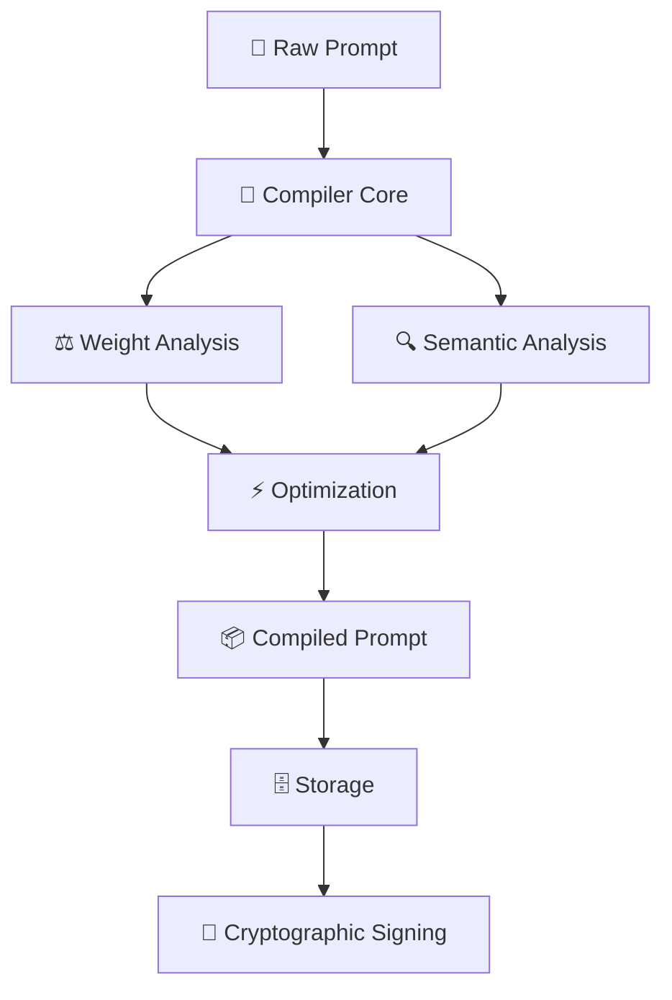

# Prompt Compiler 🧠

[](https://www.rust-lang.org)
[](https://opensource.org/licenses/MIT)
[](https://github.com/neeboo/prompt-compiler)

English | [中文文档](./README.zh.md)

[中文文档](./README.zh.md) | English

A state-of-the-art AI prompt compiler based on the groundbreaking research "*Learning without training: The implicit dynamics of in-context learning*". This tool compiles, optimizes, and version-controls natural language prompts using implicit weight update dynamics from transformer theory.

## 🎯 Core Concept

Built upon the fundamental discovery that **in-context learning (ICL) is equivalent to implicit low-rank weight updates in MLP layers**:

```
T_W(C,x) = T_{W+ΔW(C)}(x)
```

Where `ΔW(C)` represents a **rank-1 weight update** generated from context C.

## ✨ Key Features

- 🔄 **Prompt Compilation**: Transform natural language prompts into optimized intermediate representations (IR)
- ⚡ **Intelligent Optimization**: Multi-layered optimization strategies based on weight update theory
- 🌳 **Version Control**: Git-style DAG version management system for prompt evolution
- 🔐 **Cryptographic Verification**: Ed25519 signatures ensure data integrity
- 🗄️ **High-Performance Storage**: RocksDB persistent storage with efficient indexing
- 📊 **Weight Dynamics Analysis**: Real-time computation and analysis of implicit weight updates

## 🚀 Quick Start

### Prerequisites
- Rust 1.70+
- Git
- 8GB+ RAM (for large weight matrix computations)

### Installation

```bash
# Clone the repository
git clone https://github.com/neeboo/prompt-compiler.git
cd prompt-compiler

# Build the entire workspace
cargo build --release

# Build specific crates
cargo build -p prompt-compiler-cli --release
cargo build -p prompt-compiler-web --release

# Install CLI tool to system PATH
cargo install --path crates/prompt-compiler-cli

# Install web server
cargo install --path crates/prompt-compiler-web
```

### Verification

```bash
# Check version
pc version

# Run weight dynamics demo
pc weight-demo -c 3 --verbose
```

### Basic Usage

```bash
# Using CLI (after installing prompt-compiler-cli)
pc compile -p "You are a professional Rust developer. Help me optimize code performance" \
  -m gpt-4 --enable-weight-analysis

# Analyze prompt quality
pc analyze -p "Write a sorting algorithm" -a semantic

# Optimize prompts with constraints
pc optimize -p "Help me write code" -O all -b 500

# Demonstrate weight update dynamics
pc weight-demo -c 5 --verbose

# Start web server (after installing prompt-compiler-web)
pc-server
# Server will run on http://localhost:3000
```

### Using the SDK

```rust
use prompt_compiler_sdk::{PromptCompilerSDK, SDKConfig};

#[tokio::main]
async fn main() -> Result<(), Box<dyn std::error::Error>> {
    let config = SDKConfig {
        enable_storage: true,
        storage_path: Some("./my_app.db".to_string()),
        ..Default::default()
    };
    
    let sdk = PromptCompilerSDK::new(config).await?;
    
    let compiled = sdk.compile("Write efficient Rust code").await?;
    println!("Compiled prompt: {:?}", compiled);
    
    Ok(())
}
```

### Quick Test

```bash
# Test the CLI tool
./target/release/pc weight-demo -c 5 --verbose
```

## 🏗️ Project Structure

```
prompt-compiler/
├── 📦 crates/                     # Core crates collection
│   ├── 🧠 prompt-compiler-core/   # Core compilation engine
│   │   ├── src/
│   │   │   ├── lib.rs            # Main library interface
│   │   │   ├── error.rs          # Error types & handling
│   │   │   ├── ir.rs             # Intermediate representation
│   │   │   └── compiler/         # Compilation pipeline
│   │   │       ├── mod.rs        # Pipeline orchestration
│   │   │       ├── analyzers/    # Prompt analysis modules
│   │   │       ├── optimizers/   # Optimization strategies
│   │   │       └── generators/   # Output generation
│   │   └── Cargo.toml
│   │
│   ├── 🖥️  prompt-compiler-cli/   # Command-line interface
│   │   ├── src/
│   │   │   ├── main.rs           # Entry point → `pc` binary
│   │   │   ├── lib.rs            # CLI library functions
│   │   │   └── cli.rs            # Command implementations
│   │   └── Cargo.toml
│   │
│   ├── ⚖️  prompt-compiler-weights/ # Weight dynamics engine
│   │   ├── src/
│   │   │   └── lib.rs            # ICL weight update theory
│   │   ├── benches/
│   │   │   └── weight_dynamics.rs # Performance benchmarks
│   │   └── Cargo.toml
│   │
│   ├── 🗄️  prompt-compiler-storage/ # Persistence layer
│   │   ├── src/
│   │   │   ├── lib.rs            # Storage interface
│   │   │   ├── state_db.rs       # RocksDB operations
│   │   │   └── dag.rs            # Version control DAG
│   │   └── Cargo.toml
│   │
│   ├── 🔐 prompt-compiler-crypto/  # Security & verification
│   │   ├── src/
│   │   │   └── lib.rs            # Ed25519 + hashing
│   │   └── Cargo.toml
│   │
│   ├── 🌐 prompt-compiler-web/     # Web API server
│   │   ├── src/
│   │   │   ├── main.rs           # Server → `pc-server` binary
│   │   │   └── lib.rs            # REST API endpoints
│   │   └── Cargo.toml
│   │
│   └── 📚 prompt-compiler-sdk/     # Integration SDK
│       ├── src/
│       │   └── lib.rs            # High-level client API
│       └── Cargo.toml
│
├── 📁 docs/                       # Documentation
├── 🔍 examples/                   # Usage examples
├── 🧪 tests/                      # Integration tests
├── ⚡ benches/                    # Workspace benchmarks
├── ⚙️  config.toml                # Default configuration
├── 🏗️  Cargo.toml                # Workspace manifest
└── 📖 README.md                   # This file
```

### 🎯 Core Architecture Flow



### 📊 Dependency Graph

```
                    ┌─────────────────┐
                    │  🧠 Core Engine │
                    └─────────┬───────┘
                              │
        ┌─────────────────────┼─────────────────────┐
        │                     │                     │
        ▼                     ▼                     ▼
   ┌─────────┐         ┌─────────────┐       ┌─────────────┐
   │ ⚖️ Weights │         │ 🗄️ Storage   │       │ 🔐 Crypto   │
   └─────────┘         └─────────────┘       └─────────────┘
        │                     │                     │
        └─────────────────────┼─────────────────────┘
                              │
        ┌─────────────────────┼─────────────────────┐
        │                     │                     │
        ▼                     ▼                     ▼
   ┌─────────┐         ┌─────────────┐       ┌─────────────┐
   │ 🖥️ CLI   │         │ 🌐 Web API  │       │ 📚 SDK      │
   └─────────┘         └─────────────┘       └─────────────┘
```

### 🚀 Binary Outputs

| Binary | Crate | Description |
|--------|-------|-------------|
| `pc` | prompt-compiler-cli | 🖥️ Command-line tool for prompt compilation |
| `pc-server` | prompt-compiler-web | 🌐 Web server with REST API |

### 🔧 Technology Stack

<table>
<tr>
<td><strong>🧠 Core</strong></td>
<td>

- **Rust** - Memory-safe systems programming
- **nalgebra** - Linear algebra for weight computations
- **ndarray** - Multi-dimensional array operations

</td>
</tr>
<tr>
<td><strong>🗄️ Storage</strong></td>
<td>

- **RocksDB** - High-performance key-value store
- **serde** - Serialization framework

</td>
</tr>
<tr>
<td><strong>🔐 Security</strong></td>
<td>

- **Ed25519** - Digital signatures
- **SHA-256** - Cryptographic hashing

</td>
</tr>
<tr>
<td><strong>🌐 Web</strong></td>
<td>

- **Axum** - Modern async web framework
- **Tower** - Service-oriented middleware

</td>
</tr>
</table>

## 🔬 Theoretical Implementation

### Weight Update Computation
Core algorithm based on the research paper:

```rust
// Compute rank-1 weight update
pub fn compute_weight_update(
    pretrained_weights: &Matrix,
    context_vector: &Vector,
    query_vector: &Vector,
) -> Matrix {
    let w_delta_a = pretrained_weights * context_vector;
    let query_norm_sq = query_vector.norm_squared();
    
    // ΔW = (W·ΔA) · A^T / ||A||²
    (w_delta_a * query_vector.transpose()) / query_norm_sq
}
```

## 🧠 Theoretical Foundation

## 🧠 Theoretical Foundation

### Implicit Weight Updates

Based on the research discovery, our compiler implements:

1. **Context Vectorization**: Transform prompt context into vector representations
2. **Weight Update Calculation**: Using formula `ΔW = (W·ΔA) · A^T / ||A||²`
3. **Convergence Analysis**: Predict convergence behavior of weight updates
4. **Optimization Strategy**: Adjust prompt structure based on weight update effectiveness

### Key Equations

```
// Weight update formula
ΔW(Y) = (W·ΔA(Y)) · A(C\Y,x)^T / ||A(C\Y,x)||²

// Sequential learning dynamics
W_i = W_{i-1} - h·∇_W L_i(W_{i-1})

// Where h = 1/||A(x)||² is the adaptive learning rate
```

## 📊 Usage Examples

### 1. Basic Compilation

```bash
pc compile -p "Please write an efficient sorting algorithm with O(n log n) time complexity" --enable-weight-analysis
```

Output:
```
🚀 Starting prompt compilation...
📊 Weight update analysis enabled
📝 Compilation Result:
==================================================
## Task Objective
Please write an efficient sorting algorithm with O(n log n) time complexity

## Execution Instructions
- Keep response within 1000 tokens
- Task priority: 5/10
- Weight update optimization applied
==================================================

📊 Compilation Statistics:
Target model: gpt-4
Token budget: 1000
Priority: 5/10
Weight updates count: 3
Effectiveness score: 0.745
Converged: Yes
```

### 2. Weight Dynamics Demo

```bash
pc weight-demo -c 5 --verbose
```

Output:
```
🧠 Weight Update Dynamics Demo
Based on: Learning without training: The implicit dynamics of in-context learning

🔢 Computing sequential weight updates...

📊 Weight Update Sequence:
Step 1: Update norm = 0.2345, Effectiveness = 0.1234
   Context vector norm: 0.8765
   Query vector norm: 0.9876
Step 2: Update norm = 0.1987, Effectiveness = 0.2145
   ...

🎯 Convergence Analysis:
Convergence rate: 0.8234
Converged: Yes

💡 This demonstrates the implicit weight update mechanism described in the paper
```

## 🔧 Configuration

Create `config.toml`:

```toml
[compiler]
default_model = "gpt-4"
default_token_budget = 1000
enable_weight_analysis = true
analyzers = ["semantic", "context"]
optimizers = ["weight", "budget"]

[storage]
database_path = "./prompt_compiler_db"
enable_compression = true
max_cache_size = 1000

[crypto]
enable_signing = true
key_path = "~/.prompt_compiler/keys"
```

## 🧪 Testing and Benchmarks

```bash
# Run all tests in workspace
cargo test

# Test specific crates
cargo test -p prompt-compiler-core
cargo test -p prompt-compiler-weights

# Run performance benchmarks
cargo bench

# Benchmark specific crates
cargo bench -p prompt-compiler-weights

# Integration tests
cargo test --test integration
```

## 📋 Development Roadmap

### Phase 1: Core Implementation ✅
- [x] Basic compiler architecture
- [x] Weight update dynamics computation
- [x] RocksDB storage layer
- [x] CLI interface

### Phase 2: Enhanced Features 🔄
- [ ] Multi-model adapters
- [ ] Distributed weight computation
- [ ] Web interface
- [ ] API service

### Phase 3: Ecosystem Expansion 📅
- [ ] Plugin system
- [ ] Cloud synchronization
- [ ] Machine learning model integration
- [ ] Real-time collaboration features

## 🤝 Contributing

### Development Workflow
1. **Fork** this repository
2. **Create branch**: `git checkout -b feature/your-feature`
3. **Develop**: Follow Rust best practices
4. **Test**: `cargo test && cargo bench`
5. **Commit**: `git commit -m "feat: add amazing feature"`
6. **Push**: `git push origin feature/your-feature`
7. **PR**: Create Pull Request

### Code Standards
- Use `cargo fmt` for code formatting
- Use `cargo clippy` for code quality checks
- Add tests for new features
- Update relevant documentation

## 📊 Performance Benchmarks

Test results on M1 MacBook Pro:

| Operation                 | Average Time | Memory Usage |
| ------------------------- | ------------ | ------------ |
| Basic compilation         | ~50ms        | 12MB         |
| Weight update computation | ~200ms       | 45MB         |
| Storage operations        | ~5ms         | 8MB          |
| DAG traversal             | ~10ms        | 15MB         |

*Benchmarks based on average of 1000 operations*

## 🔍 Use Cases

### 1. Academic Research
- Verify theoretical assumptions from the paper
- Analyze convergence of different prompt structures
- Compare weight update effectiveness

### 2. Engineering Applications
- Optimize AI prompts in production environments
- Version control prompt evolution
- Automated prompt quality assessment

### 3. Education and Training
- Visualize in-context learning processes
- Understand transformer internal mechanisms
- Practice AI system optimization

## 📚 Related Research

- **Primary Theoretical Foundation**: [Learning without training: The implicit dynamics of in-context learning](https://arxiv.org/abs/2507.16003)
- **Transformer Architecture**: [Attention is All You Need](https://arxiv.org/abs/1706.03762)
- **In-Context Learning**: [Language Models are Few-Shot Learners](https://arxiv.org/abs/2005.14165)

## 📄 License

This project is licensed under the MIT License - see the [LICENSE](LICENSE) file for details.

## 🙏 Acknowledgments

Special thanks to the authors of the foundational research:
- Benoit Dherin, Michael Munn, Hanna Mazzawi, Michael Wunder, Javier Gonzalvo (Google Research)

---

**Building Smarter AI Interactions** 🚀