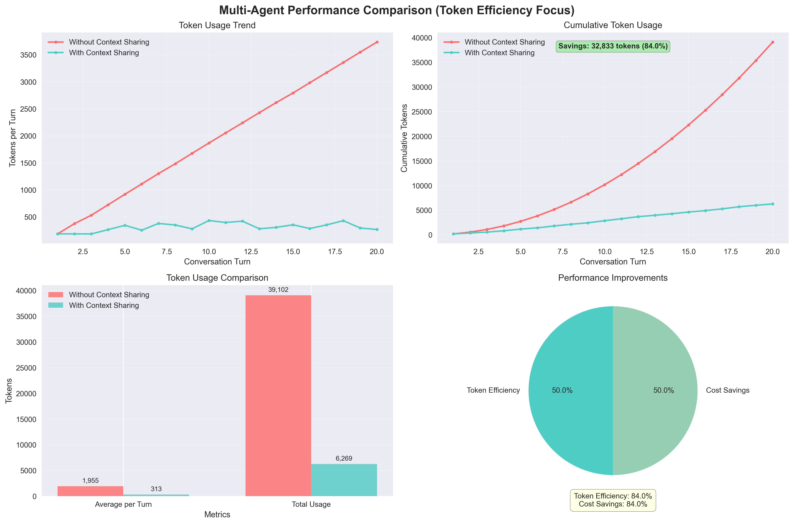

# PC Node Performance Analysis Report

*Generated on: 2025/08/09*

## 📊 Test Overview

### Single Agent Test Results
- **Token Efficiency Improvement**: 80.7%
- **Token节省**: 25657 tokens

### Multi-Agent Test Results
- **Token Efficiency Improvement**: 84.0%
- **Token节省**: 32833 tokens

## 💡 Performance Insights

### Context Sharing Effectiveness
- **Single Agent Efficiency**: 80.7%
- **Multi-Agent Efficiency**: 84.0%
- **Scalability Factor**: 1.04

### Complexity Impact
- **Single Agent Avg Tokens**: 323 tokens
- **Multi-Agent Avg Tokens**: 313 tokens
- **Complexity Overhead**: -3.0%

## 💰 Token Savings Analysis

### Single Agent Scenario
- **Without Context Sharing**: 31,796 tokens
- **With Context Sharing**: 6,139 tokens
- **Savings**: 25,657 tokens (80.7%)
- **Per Round Savings**: 1350 tokens

### Multi-Agent Scenario
- **Without Context Sharing**: 39,102 tokens
- **With Context Sharing**: 6,269 tokens
- **Savings**: 32,833 tokens (84.0%)
- **Per Round Savings**: 1642 tokens

### Total Savings
- **Total Token Savings**: 58,490 tokens
- **Total Savings Percentage**: 82.5%
- **Average Per Round Savings**: 1496 tokens

## 🎯 Usage Recommendations

### When to Use Context Sharing
- ✅ Single agent scenario shows 80.7% token efficiency improvement, recommended for use
- ✅ Multi-agent scenario shows 84.0% token efficiency improvement, highly recommended

### Performance Optimization
- ⚡ Context Sharing effectively reduces token usage and improves response efficiency

### Cost Optimization
- 💰 Context Sharing significantly reduces API call costs

### Architecture Considerations

## 📋 Summary

This test validates the performance of PC Node's Context Sharing capabilities:

1. **Single Agent Scenario**: Context Sharing achieved 80.7% token efficiency improvement
2. **Multi-Agent Scenario**: Context Sharing achieved 84.0% token efficiency improvement
3. **Token Savings**: Average per round savings - 1496 tokens
4. **Scale Projection**: Savings per 1,000 rounds - 1496009 tokens

---
*Report automatically generated by PC Node | Data source: Comprehensive performance testing*
