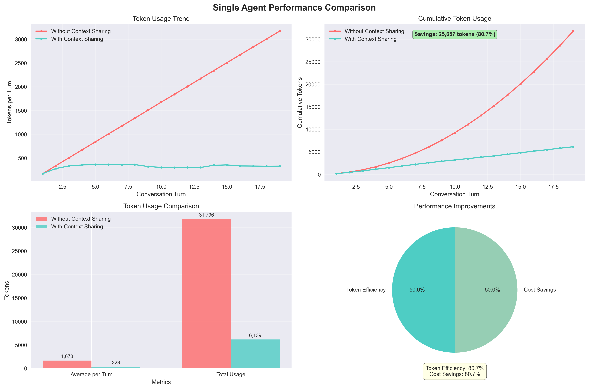

# PC Node Performance Analysis Report

*Generated on: 2025/08/07*

## 📊 Test Overview

### Single Agent Test Results
- **Token Efficiency Improvement**: 90.3%
- **Token节省**: 28727 tokens

### Multi-Agent Test Results
- **Token Efficiency Improvement**: 91.3%
- **Token节省**: 36103 tokens

## 💡 Performance Insights

### Context Sharing Effectiveness
- **Single Agent Efficiency**: 90.3%
- **Multi-Agent Efficiency**: 91.3%
- **Scalability Factor**: 1.01

### Complexity Impact
- **Single Agent Avg Tokens**: 162 tokens
- **Multi-Agent Avg Tokens**: 172 tokens
- **Complexity Overhead**: 6.7%

## 💰 Token Savings Analysis

### Single Agent Scenario
- **Without Context Sharing**: 31,796 tokens
- **With Context Sharing**: 3,069 tokens
- **Savings**: 28,727 tokens (90.3%)
- **Per Round Savings**: 1512 tokens

### Multi-Agent Scenario
- **Without Context Sharing**: 39,549 tokens
- **With Context Sharing**: 3,446 tokens
- **Savings**: 36,103 tokens (91.3%)
- **Per Round Savings**: 1805 tokens

### Total Savings
- **Total Token Savings**: 64,830 tokens
- **Total Savings Percentage**: 90.9%
- **Average Per Round Savings**: 1659 tokens

## 🎯 Usage Recommendations

### When to Use Context Sharing
- ✅ Single agent scenario shows 90.3% token efficiency improvement, recommended for use
- ✅ Multi-agent scenario shows 91.3% token efficiency improvement, highly recommended

### Performance Optimization
- ⚡ Context Sharing effectively reduces token usage and improves response efficiency

### Cost Optimization
- 💰 Context Sharing significantly reduces API call costs

### Architecture Considerations

## 📋 Summary

This test validates the performance of PC Node's Context Sharing capabilities:

1. **Single Agent Scenario**: Context Sharing achieved 90.3% token efficiency improvement
2. **Multi-Agent Scenario**: Context Sharing achieved 91.3% token efficiency improvement
3. **Token Savings**: Average per round savings - 1659 tokens
4. **Scale Projection**: Savings per 1,000 rounds - 1658549 tokens

---
*Report automatically generated by PC Node | Data source: Comprehensive performance testing*
