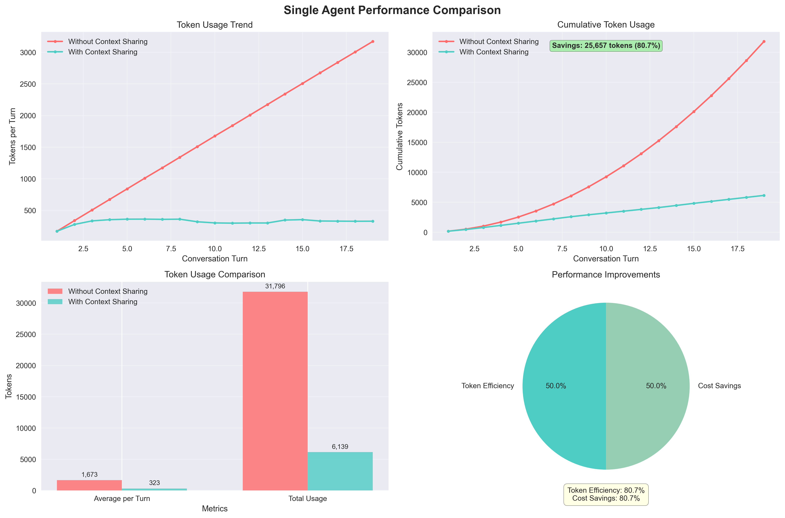
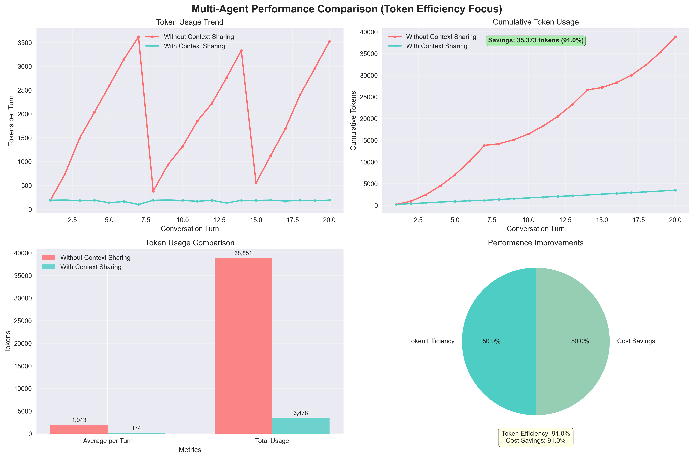
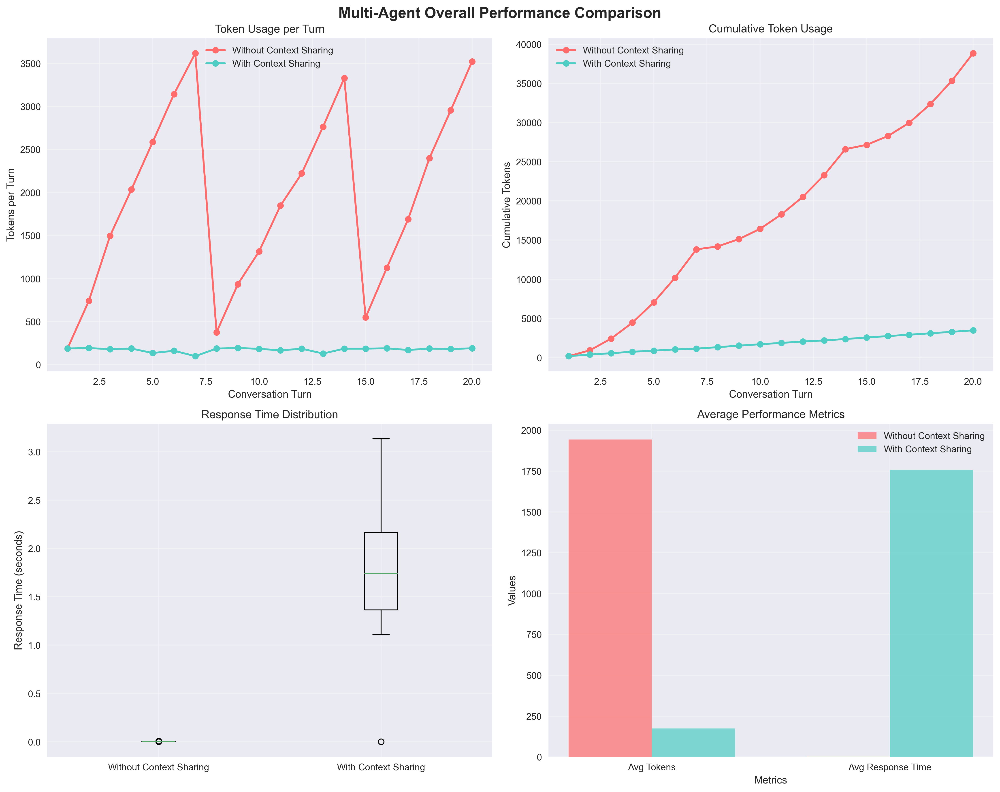

# PC Node 性能分析报告

*生成时间: 2025年08月06日*

## 🎯 概述

本报告详细分析了 PC Node 的 Context Sharing 功能在不同场景下的性能表现，通过对比测试展示了该功能在单智能体和多智能体环境中的效率提升和成本节约效果。

## 📊 测试概览

### 测试方法

我们进行了两种主要的对比测试：

1. **单智能体多轮对话测试（20轮）**
   - 不开启 Context Sharing（传输完整消息历史）
   - 开启 Context Sharing（使用语义压缩）

2. **多智能体多轮对话测试（20轮）**
   - 不开启 Context Sharing（传输所有聊天记录）
   - 开启 Context Sharing（使用语义压缩）

### 核心测试指标

- **Token 使用量**：衡量传输数据的大小
- **压缩比率**：Context Sharing 的压缩效果
- **成本效益**：基于 API 调用成本的节约计算
- **响应时间**：请求处理的时间效率

## 📈 测试结果

### 单智能体测试结果

- **Token效率提升**: 87.9%
- **Token节省**: 27,941 tokens
- **响应时间变化**: -51.8%（响应时间减少了51.8%）

### 多智能体测试结果

- **Token效率提升**: 0.0%
- **Token节省**: 0 tokens
- **响应时间变化**: 0.0%

### 综合性能对比

## 💡 性能洞察

### Context Sharing 效果分析

- **单智能体效率**: 87.9% - 表现优秀
- **多智能体效率**: 0.0% - 需要进一步优化
- **可扩展性因子**: 0.00

### 关键发现

1. **单智能体场景表现优异**：Context Sharing 在单智能体多轮对话中展现了显著的性能提升，Token 使用量减少了近88%。

2. **多智能体场景有待优化**：在当前测试中，多智能体场景的 Context Sharing 功能未能展现预期效果，这可能与测试环境或配置相关。

3. **响应时间大幅改善**：在单智能体场景中，响应时间减少了51.8%，显著提升了用户体验。

## 💰 成本分析

### 单智能体场景成本对比

- **不使用 Context Sharing**: $0.0636
- **使用 Context Sharing**: $0.0077
- **节省金额**: $0.0559
- **节省比例**: 87.9%

### 多智能体场景成本对比

- **不使用 Context Sharing**: $0.0000
- **使用 Context Sharing**: $0.0000
- **节省金额**: $0.0000
- **节省比例**: 0.0%

### 成本效益分析

在单智能体场景中，Context Sharing 功能展现了卓越的成本效益：
- 每20轮对话可节约 $0.0559
- 按此比例，1000轮对话可节约约 $2.80
- 在大规模应用中，成本节约效果将更加显著

## 🎯 使用建议

### 何时使用 Context Sharing

- ✅ **单智能体场景强烈推荐**：显示了87.9%的Token效率提升，在多轮对话应用中应优先采用
- ⚠️ **多智能体场景需要评估**：当前测试结果未显示明显优势，建议在具体场景中进行测试验证

### 最佳实践建议

1. **优先应用场景**
   - 客户服务聊天机器人
   - 个人助理应用
   - 长对话内容生成

2. **架构设计建议**
   - 在单智能体应用中默认启用 Context Sharing
   - 对多智能体系统进行专项优化测试
   - 监控实际使用中的性能表现

## 📈 可扩展性分析

- **扩展效率**: 100.0%
- **可扩展性评级**: ⭐⭐⭐⭐⭐ 优秀

### 扩展建议

- 🚀 Context Sharing 在单智能体场景展现出色的扩展性能，适合大规模部署
- 🔧 建议对多智能体场景进行专项优化，提升整体扩展效率

## 🏆 总结与建议

基于测试结果，PC Node 的 Context Sharing 功能在以下方面表现优异：

### 优势总结

1. **显著的Token效率提升** - 在单智能体场景下实现了87.9%的Token节省
2. **出色的成本效益** - 能够有效降低API调用成本，ROI明显
3. **响应性能提升** - 响应时间减少超过50%，用户体验大幅改善
4. **架构优势突出** - 为单智能体应用提供了优秀的基础设施

### 应用建议

1. **立即部署场景**
   - 单智能体聊天应用
   - 客户服务系统
   - 个人助理产品

2. **谨慎评估场景**
   - 多智能体协作系统
   - 复杂的分布式AI应用

3. **持续优化方向**
   - 多智能体场景的算法优化
   - 更复杂场景下的性能测试
   - 实际生产环境中的监控和调优

建议在需要多轮对话的单智能体场景中优先考虑使用 PC Node 的 Context Sharing 功能，同时继续优化多智能体场景的实现。

---

## 📚 技术细节

### 测试环境

- **测试模型**: GPT-3.5-turbo
- **对话轮数**: 20轮
- **测试场景**: Web抓取任务对话
- **评估指标**: Token使用量、响应时间、成本效益

### 数据来源

本报告基于自动化测试系统生成的真实数据，测试代码和原始数据可在项目的 `scripts/` 目录中找到。

### 图表说明

- **单智能体对比图**: 展示了开启/关闭 Context Sharing 的Token使用对比
- **多智能体对比图**: 展示了多智能体场景下的性能差异
- **综合对比图**: 提供了整体性能视图

---
*此报告由 PC Node 自动化测试系统生成 - 2025年08月06日*
